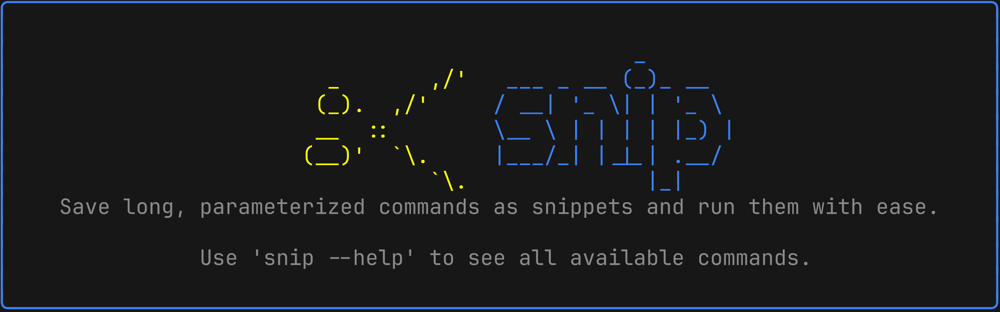

# snip



`snip` stores shell commands as templates with `{{placeholders}}`, then resolves
and runs them with the changing parts supplied as `key=value` arguments or filled
in interactively. The fully-resolved command is shown for confirmation before it
runs, and the last value used for each variable is remembered as the next default.

## Install

With Go (recommended):

```sh
go install github.com/54L1M/snip@latest   # or @v0.1.1 for a specific release
```

The binary is installed to `$(go env GOPATH)/bin` (or `$GOBIN`) as `snip`; make
sure that directory is on your `PATH`. The version is taken from the release tag
automatically.

From source:

```sh
make build          # -> ./bin/snip
make install        # builds the latest git tag into /usr/local/bin (needs a tag)
make install-config # writes ~/.config/snip/.snip
```

## Usage

```sh
# Save a snippet (mark changing parts with {{...}})
snip add deploy --cmd 'docker run -d --name {{app}} \
  -p {{port}}:8080 -e ENV={{env}} \
  registry.example.com/{{app}}:{{tag}}' -d "Run a service container"

# Or start from the last command you ran: it opens in your editor so you can
# swap the changing parts for {{placeholders}}, then it's saved.
snip add deploy --last

# Run it: pass what you know, get prompted for the rest (defaults pre-filled)
snip run deploy app=web tag=1.4.2

# Pick interactively and fill everything in a form
snip run

# Print the resolved command without running it
snip run deploy app=web tag=1.4.2 --print

# Manage
snip ls
snip show deploy
snip edit deploy
snip rm deploy
```

By default `snip run` shows the resolved command and asks `Run this? [y/N]`
before executing. Pass `-y` to skip the prompt, or set `AUTO_CONFIRM=true` in
`~/.config/snip/.snip`.

## `snip add --last`

`--last` reads your shell history file (`$HISTFILE`, else `~/.zsh_history` or
`~/.bash_history` based on `$SHELL`), grabs the most recent command — skipping
`snip` invocations so it never captures itself — and opens it in your editor so
you can turn the changing parts into `{{placeholders}}`. It understands zsh
`EXTENDED_HISTORY`, bash `HISTTIMEFORMAT` timestamps, and multi-line commands.

> **Note:** by default zsh only writes history to the file when the shell
> exits, so `--last` may see an older command than the one you just ran. Enable
> immediate writes with `setopt INC_APPEND_HISTORY` (or `SHARE_HISTORY`, which
> oh-my-zsh turns on) in your `~/.zshrc`. bash users: history is written on exit
> unless `PROMPT_COMMAND='history -a'` is set.

## Configuration

`snip setup` writes `~/.config/snip/.snip`:

| Key            | Meaning                                                                                            |
| -------------- | -------------------------------------------------------------------------------------------------- |
| `EDITOR`       | Editor for `snip add` (no `--cmd`) and `snip edit`. Falls back to `$EDITOR`, `$VISUAL`, then `vi`. |
| `AUTO_CONFIRM` | `true` skips the run confirmation prompt.                                                          |

Snippets are stored in `~/.config/snip/snippets.json`.

## Shell completion

`snip` ships completion scripts. Beyond subcommands and flags, `run`, `show`,
`edit`, and `rm` complete your **saved snippet names**, and `snip run <name>`
then completes the remaining `var=` placeholders.

```sh
# zsh — load on each shell
echo 'source <(snip completion zsh)' >> ~/.zshrc
# zsh — or install once into your fpath
snip completion zsh > "${fpath[1]}/_snip"

# bash
echo 'source <(snip completion bash)' >> ~/.bashrc

# fish
snip completion fish > ~/.config/fish/completions/snip.fish
```

(zsh also needs `autoload -U compinit && compinit` in `~/.zshrc` if you don't
already have it.)

## Stack

cobra + viper + [charm](https://charm.sh) (bubbletea / bubbles / lipgloss).

## License

[MIT](LICENSE)
